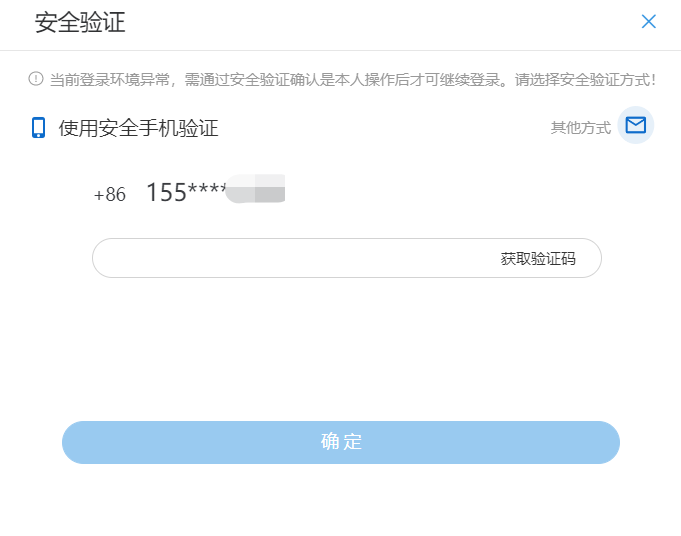
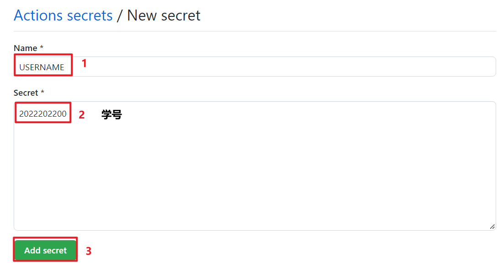
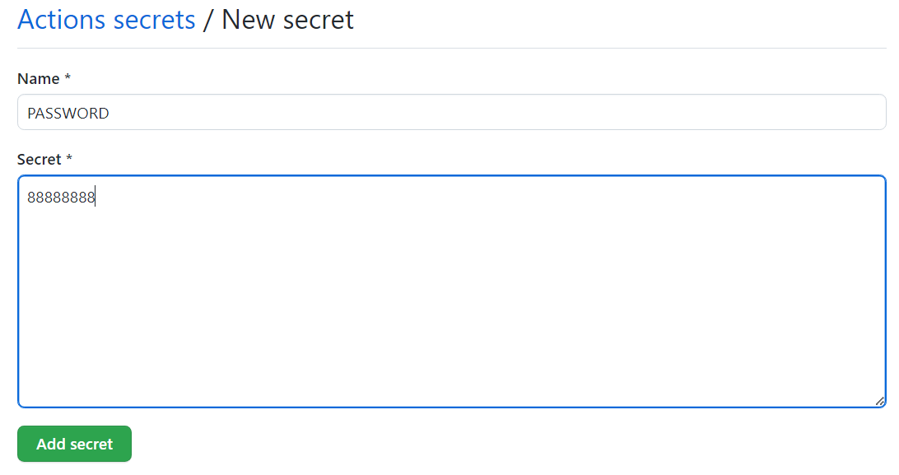
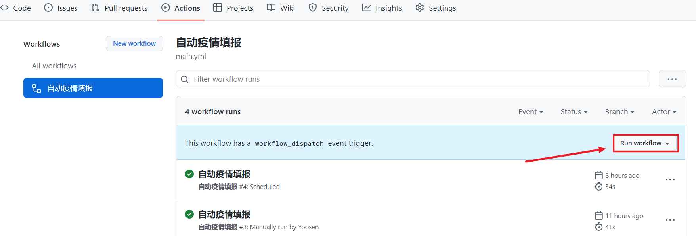

# 瓜大疫情填报


## ❗️❗️❗️ 登陆时新添加了安全验证导致Action失效




**希望你永远不会再因未填报被艾特**

## 使用须知

- 本项目仅提供学习参考，请如实进行疫情填报

- **请阅读「免责声明」后使用，因使用本项目导致的一切不良后果请使用者自行承担**

- 打卡可能会 **失败**

- 默认打卡时间是中午 12 点， Action 可能会延迟 `1-2h`

- 默认填报信息，暂不支持更改（寒假有时间可以加上 **在家** 状态的提交）：

  > 当前所在位置：     **在学校**
  >
  > 今天的体温范围：   **37.3度以下**
  >
  > 您有无疑似症状？： **无**
  >
  > 西安市一码通状态： **绿码**

## 使用流程

1. 点击项目右上角的`Fork`，`Fork`此项目

2. 到自己`Fork`的项目点击`Settings`->`Secrets`->`Actions`->`New responsitory secrets`

3. 填写`Name`，和`Secret`，需要添加以下两个
   - **USERNAME** -> 学号

     

   - **PASSWORD** -> 密码(仅该项目中保存使用，不会造成泄露，除非 Github 泄露)

     

4. 点击"`Actions`"，在左侧的"`自动疫情填报`" 点击"`Run workflow`"即可手动执行签到，后续可运行按照`schedule`(main yaml)，默认在每天12:00(中午)自动签到，可自行修改

   

   > 更改 [main yaml](.github/workflows/main.yml) 中 cron 项即可**更改填报时间**
   >
   > ``` yaml
   > schedule:
   >    # 此时间为 'UTC时间', +8h 后为 '北京时间'，即中午12点准时打卡
   >    - cron: '0 4 * * *' 
   > ```
   > 定时任务由Github调度, 实际执行时间可能延迟1-2h不定

5. ~~有问题可以提 `issue`~~


## TODO

- [ ] 在家状态
- [ ] 推送服务


## 免责声明

> 本项目参考 [nwpu-auto-yqtb](https://github.com/2ndelement/nwpu-auto-yqtb)，仅将原项目本地保存学号密码等需要隐藏的信息更改到 Github Secrets。
>
> 任何用户在使用开源的 「瓜大疫情填报」 前，请您仔细阅读并透彻理解本声明。您可以选择不使用 「瓜大疫情填报」，若您一旦使用该开源项目，您的使用行为即被视为对本声明全部内容的认可和接受。

1. 您承诺秉着合法、合理的原则使用 「瓜大疫情填报」 开源项目，不利用 「瓜大疫情填报」开源项目进行任何违法、侵害他人合法利益等恶意的行为，**不得违反学校相关规定**，亦不将 「瓜大疫情填报」开源项目运用于任何违反中国法律法规的平台。
2. 任何单位或个人因下载使用 「瓜大疫情填报」开源项目而产生的任何意外、疏忽、合约毁坏、诽谤、版权或知识产权侵犯及其造成的损失 (包括但不限于直接、间接、附带或衍生的损失等)，**本人不承担任何法律责任** 。
3. 用户明确并同意本声明列举的全部内容，对使用 「瓜大疫情填报」开源项目**可能存在的风险和相关后果将完全由用户自行承担** ，本人不承担任何法律责任。
4. 任何单位或个人在阅读本免责声明后，应在《MIT 开源许可证》所允许的范围内进行合法的发布、传播和使用 「瓜大疫情填报」开源项目等行为，若违反本免责声明条款或违反法律法规所造成的法律责任(包括但不限于民事赔偿和刑事责任），由违约者自行承担。
5. 如果本声明的任何部分被认为无效或不可执行，则该部分将被解释为反映本人的初衷，其余部分仍具有完全效力。不可执行的部分声明，并不代表本人放弃执行该声明的权利。
